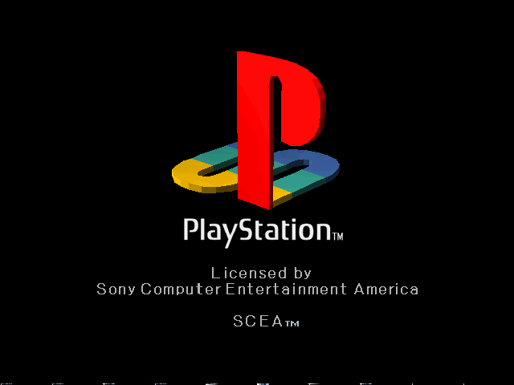
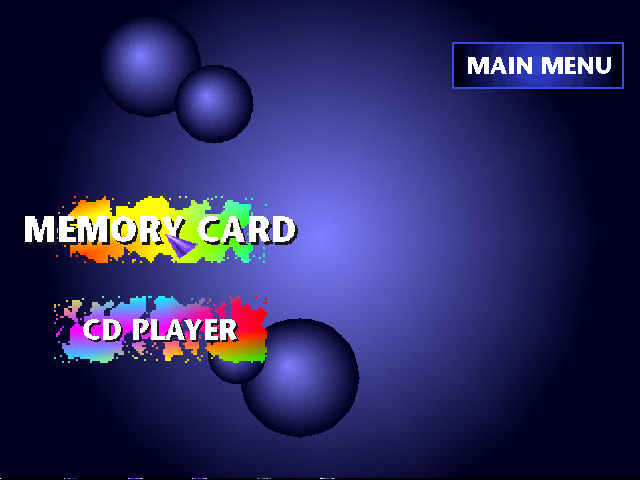

<h1 align="center">wobble-psx</h1>

<p align="center">
  A PlayStation 1 emulator, named after the console's famously wobbly
  vertex graphics.
</p>

<p align="center">
  <a href="https://github.com/eduardovra/wobble-psx/actions/workflows/ci.yml"></a>
  
  
  
  
</p>

<p align="center">
  
  
</p>

It boots the retail BIOS to its shell — the main menu, with the memory
card and CD player entries, drawn and responding to the controller —
and it reads discs. A game image in the drive is found, identified and
booted: the BIOS reads `SYSTEM.CNF` off the disc, loads the executable
it names, and runs it. Games boot, run their startup, draw and make
sound. None is playable yet.

## Getting started

You need CMake ≥ 3.24, a C++20 compiler and a PlayStation BIOS image
of your own. SDL3, Dear ImGui and miniz are fetched and built by CMake
(nothing is installed to the system). On Debian/Ubuntu the headers SDL
needs come from `build-essential libx11-dev libxext-dev libwayland-dev
libxkbcommon-dev libgl1-mesa-dev`.

```sh
cmake -B build-rel -G Ninja -DCMAKE_BUILD_TYPE=Release
cmake --build build-rel
```

Then put a game in the drive. The zip it came in works as it is —
there is no need to unpack it, or to know which file inside to open —
and so do `.chd`, `.cue`, `.bin` and `.iso`:

```sh
./build-rel/wobble SCPH1001.BIN "Ridge Racer (USA).zip"
```

Run it from a Release build: a Debug build turns on the sanitisers and
is about 46 times slower.

## Usage

```
wobble [bios] [game] [options]

  bios              a BIOS image to boot (default: SCPH1001.BIN)
  game              a .zip, .cue or .chd to put in the drive

  --disc PATH       put PATH in the drive, whatever it is named
  --exe PATH        boot the BIOS, then side-load a PS-EXE
  -h, --help        show this and exit
```

`wobble --help` prints the same, and `wobble-dbg --help` the headless
debugger's.

## Controls

The keyboard is the controller in the first socket. The second socket
is empty, and so is every memory card slot.

| Keys | Button |
| --- | --- |
| arrow keys | d-pad |
| `X` `S` `Z` `A` | cross, circle, square, triangle |
| `Q` `W` `E` `R` | L1, L2, R1, R2 |
| Enter, right shift | start, select |

## Documentation

- [What is emulated](docs/emulation.md) — discs and disc formats, the
  MDEC and video, the SPU and sound, and what is still missing
- [The debugger](docs/debugger.md) — `wobble-dbg`, its commands, and
  the GDB stub for gdb and VS Code
- [Development](docs/development.md) — debug builds, the tests,
  formatting, linting and the commit hook

## References

- [psx-spx](https://psx-spx.consoledev.net/) — hardware documentation
